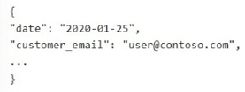

--- 
question: "You have a SQL database in Microsoft Fabric that contains a column named Payload. Payload stores customer data in JSON documents that have the following format:

Data analysis shows that some customers have subaddressing in their email address, for example, user1+promo@contoso.com. You need to return a normalized email value that removes the subaddressing, for example, user1 +promo@contoso.com must be normalized to user1@contoso.com. Which Transact-SQL expression should you use? Currently there are no comments in this discussion, be the first to comment!"
documentation: "https://learn.microsoft.com/en-us/sql/relational-databases/json/json-data-sql-server"
---

- [ ] A. REGEXP_REPLACE(JSON_VALUE(Payload, '\$.customer_email'), '\\+.*$', '')
- [ ] B. REGEXP_SUBSTR(JSON_VALUE(Payload, '\$.customer_email'), '\^[^+]+@.*$=')
- [x] C. REGEXP_REPLACE(JSON_VALUE(Payload, '\$.customer_email'), '\\+.*@', '@')
- [ ] D. REGEXP_REPLACE(JSON_VALUE(Payload, '\$.customer_email'), '\\+.*', '')