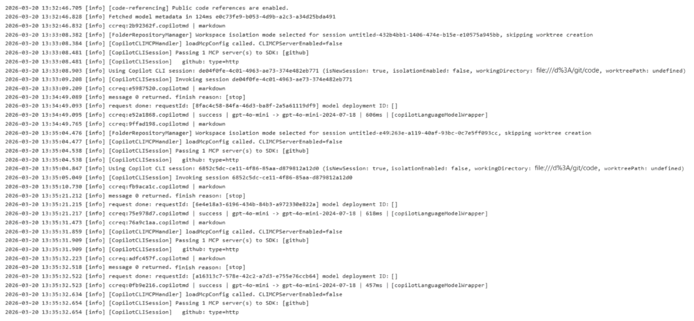

---
linked_questions:
  - question-001.md
  - question-031.md
---

# Case Study
This is a case study. Case studies are not timed separately. You can use as much exam time as you would like to complete each case. However, there may be additional case studies and sections on this exam. You must manage your time to ensure that you are able to complete all questions included on this exam in the time provided.

To answer the questions included in a case study, you will need to reference information that is provided in the case study. Case studies might contain exhibits and other resources that provide more information about the scenario that is described in the case study. Each question is independent of the other questions in this case study.

At the end of this case study, a review screen will appear. This screen allows you to review your answers and to make changes before you move to the next section of the exam. After you begin a new section, you cannot return to this section.

# GitHub Environment
Contoso uses GitHub Enterprise and assigns GitHub Copilot Pro+ licenses to its developers. The developers use Microsoft Visual Studio Code as their IDE.
Contoso has a customer portal. The code for the portal is stored in a GitHub repository named repo1 that contains the following:

- A custom agent named agent1 that includes instructions to review specs related to best practices
- A custom instruction file named validate-instructions.md that is used to validate tone of voice and applies to all .md and .txt files
- A custom instruction file named codereview.instructions.md that is used by the Copilot coding agent but is excluded for use by the Copilot code review repo1 has the following structure:
  - The front-end is stored in the /frontend folder.
  - The API logic is stored in the /api folder.
- Contoso has a second repository named repo2 that contains a legacy .NET application named App1 built by using .NET 6. repo2 has a multi-agent workflow for modernization tasks.
- Contoso enables the Model Context Protocol (MCP) registry and allows the Microsoft Learn MCP Server. Every developer must configure their own connection to the Learn MCP Server.

# Problem Statements
The developers working in repo1 report that the Microsoft Learn documentation is NOT being retrieved when they attempt to validate a design by using agent1.
The testing team at Contoso identifies that the customer portal uses inconsistent UI styles, which leads to customer confusion and branding issues. The UI inconsistencies stem from variations in the folder structure.

# Agent Logs
You have the following logs for the multi-agent workflow used in repo2.

# Planned Changes
Contoso plans to have all agents and developers in repo1 use the Microsoft Learn MCP to ensure that reviews are validated by using the appropriate documentation. This must be implemented centrally.

Contoso plans to leverage AI-powered coding agents to implement new portal features and pages.

# Technical Requirements
App1 must be upgraded to .NET 10. A previous upgrade attempt was started by using the Copilot modernization agent, but the attempt was never finalized.
You plan to retry the upgrade. You must first analyze App1 by using AI, and then generate a report that contains breaking changes and deprecated patterns before retrying the upgrade.

All AI-generated code for UI styling must adhere to a predefined folder structure.

The architects at Contoso need help building implementation plans for repo1. The company wants to implement a new agent named agent2 to analyze the code base and the code requirements, and then respond with a detailed plan. The agent must NOT be able to edit files or run local commands.

The developers must be able to delegate work to the Copilot coding agent by assigning issues to the agent.