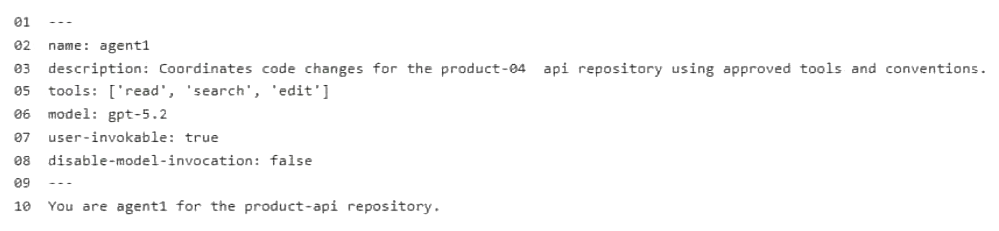

---
linked_questions:
  - question-023.md
  - question-035.md
  - question-036.md
  - question-042.md
  - question-046.md
  - question-047.md
---

# Case Study
This is a case study. Case studies are not timed separately. You can use as much exam time as you would like to complete each case. However, there may be additional case studies and sections on this exam. You must manage your time to ensure that you are able to complete all questions included on this exam in the time provided.

To answer the questions included in a case study, you will need to reference information that is provided in the case study. Case studies might contain exhibits and other resources that provide more information about the scenario that is described in the case study. Each question is independent of the other questions in this case study.

At the end of this case study, a review screen will appear. This screen allows you to review your answers and to make changes before you move to the next section of the exam. After you begin a new section, you cannot return to this section.

# GitHub Environment
The GitHub environment contains the following:
- Three repositories named product-api, billing-service, and infra-terraform.
- Branch protection on the main branch in all repositories that requires at least one pull request review before merging GitHub Actions runners used across all workflows
- A GitHub team named SG_Dev that contains developers
- A GitHub team named SG_Review that contains senior engineers and a security team
- A .github/copilot-instructions.md file that includes general coding conventions for all features

# Agent environment
The product-api repository uses a GitHub Copilot coding agent named agent1 that has the following configurations:
- No custom agent profile is defined.
- A Model Context Protocol (MCP) server named MCP1 is deployed to https://mcp.litwareinc.internal and provides access to internal ticketing and deployment APIs. MCP1 requires an API key for authentication.
- A second Copilot coding agent named agent2 handles changes in infra-terraform and runs in parallel with agent1 when both agents have open assigned issues.
- Copilot memory is NOT enabled for the organization.

# Problem Statements
Litware identifies the following issues:
- During two recent sessions, agent1 accessed files in billing-service, which is outside the agent's intended scope. agent1 makes code changes immediately after receiving a task.
- A developer named Ben, who is on the SG_Dev team, reports that agent1 completed a session with a successful status and opened a pull request, but the pull request contains no file changes. Other developers report this intermittently as well.
- Both agent1 and agent2 modified shared/config.yaml in a parallel test run, generating conflicting outputs. agent1 consistently uses raw try-catch blocks for error handling, which violates the defined implementation guidelines of SG_Dev.

# Planned Changes
Litware plans to make the following changes:
- Ensure that agent1 can access all the tools in the environment.
- Provide product-api with specific instructions to agent1 without affecting Copilot Chat or Copilot code review.
- Configure MCP1 as a tool for agent1 by modifying the product-api repository MCP configuration.
- Ensure that Copilot retains details that it has learned and uses that knowledge for future work. This must be applied to all licensed members of the organization.

# Implementation guidelines
The development team at Litware identifies the following implementation guidelines:
- Agent workflows must be able to run in parallel.
- Application error handling must use the repository ErrorHandler class. agent1 and agent2 must run on isolated branches during parallel execution. File-level conflicts must be detected before merges, and both agents must be able to run concurrently.

# Security requirements
Litware identifies the following security requirements:
- Only the members of SG_Review must be able to approve agent1 plan outputs.
- All API keys must be stored and accessed securely.
- The developers must NOT be able to self-approve.

# Agent configuration
